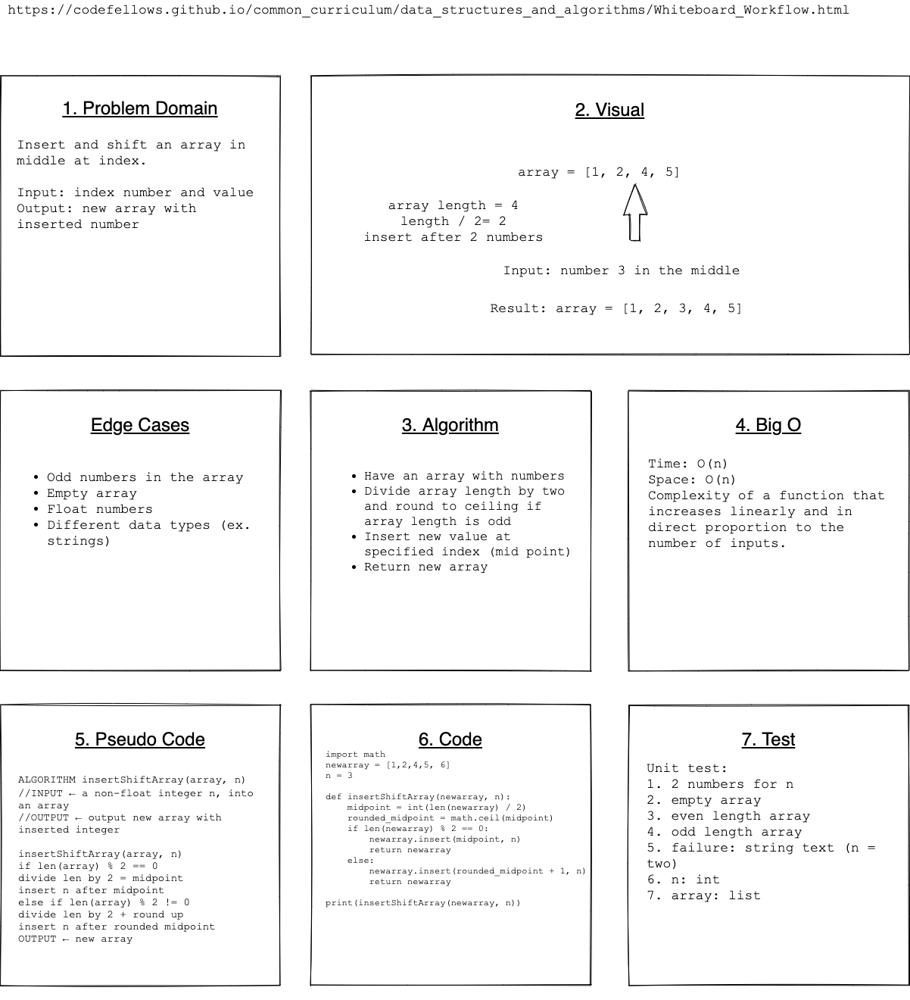

# Data Structures and Algorithms

## Language: `Python`

# Reverse an Array
Insert and shift an array in middle at index

## Challenge
Write a function called insertShiftArray which takes in an array and the value to be added. Without utilizing any of the built-in methods available to your language, return an array with the new value added at the middle index.  

## Approach & Efficiency
For the whiteboard, we used draw.io and mapped out our layout for the problem domain, visual, algorithm, Big O, Pseudocode, Code, and Test. Then we wrote out our tests and implemented our code.  

## Solution
    

## Partner
Ashley Casimir