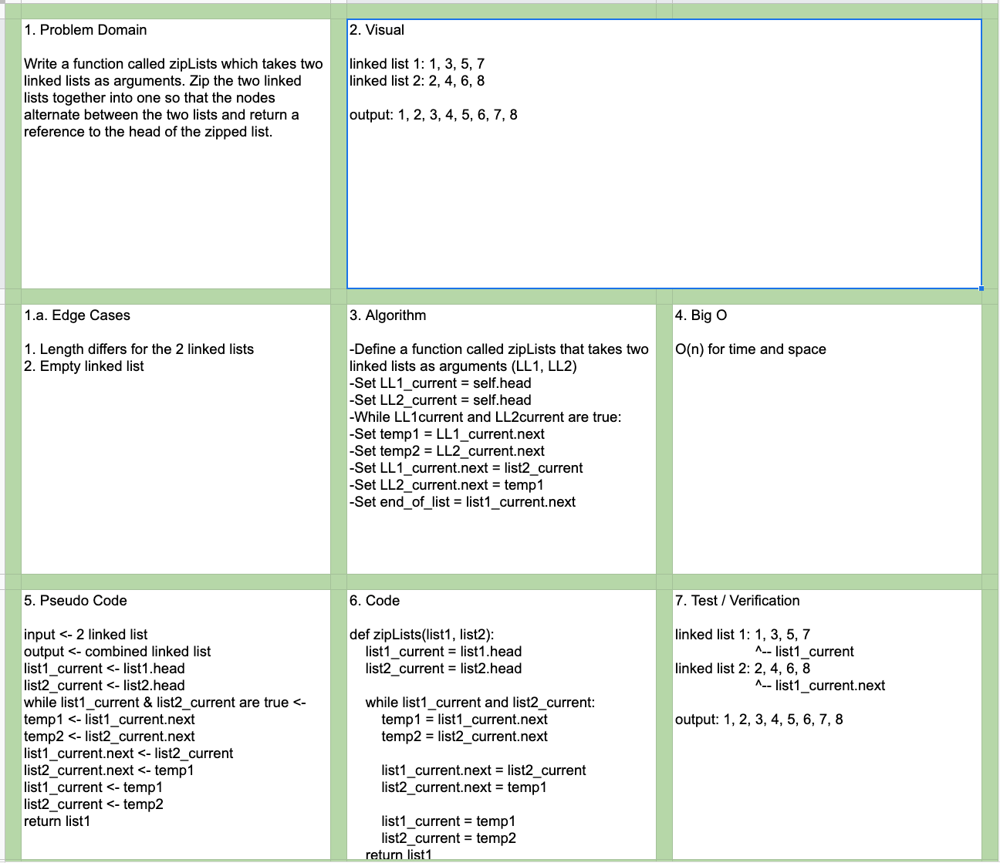

# Data Structures and Algorithms

## Language: `Python`

# Linked List - Zipped
[Click to be directed to Code Challenge](https://github.com/gracerosemary/data-structures-and-algorithms/...)      

## Challenge
Write a function called zipLists which takes two linked lists as arguments. Zip the two linked lists together into one so that the nodes alternate between the two lists and return a reference to the head of the zipped list. 

You have access to the Node class and all the properties on the Linked List class as well as the methods created in previous challenges.

## Solution
   

## Approach & Efficiency
Write code based on feature tasks and implement tests based on testing prompts.  