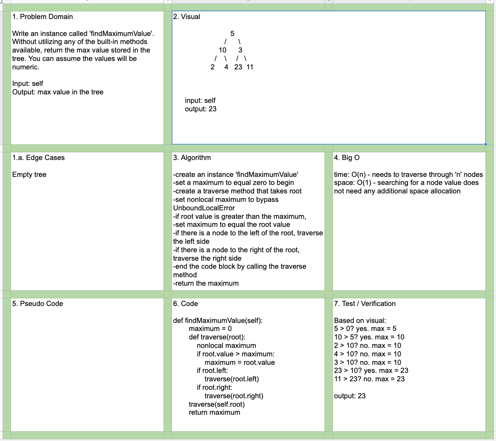

# Data Structures and Algorithms

## Language: `Python`

# Binary Tree - Find Max Value
[Click to be directed to Code Challenge](https://github.com/gracerosemary/data-structures-and-algorithms/tree/master/python/challenges/tree)      

## Challenge
Write an instance method called `find-maximum-value`. Without utilizing any of the built-in methods available to your language, return the maximum value stored in the tree. You can assume that the values stored in the Binary Tree will be numeric.

## Tests
Output a max value for a tree with 1 node. 
Output a max value for a tree with multiple nodes. 

## Approach & Efficiency
time: O(n) - needs to traverse through 'n' nodes
space: O(1) - searching for a node value does not need any additional space allocation

## API
Node class:
- `init`: instantiate with constructors

BinaryTree class:
- `init`: instantiate with constructors
- `preOrder`: Root >> Left >> Right
- `inOrder`: Left >> Root >> Right
- `postOrder`: Left >> Right >> Root
- `findMaximumValue`: returns max value in Binary Tree

BinarySearchTree class:
- `contains`: Returns True if value is in the tree, otherwise False
- `add`: Accepts a value and adds a new node with the specified value in the correct location

## Solution
  