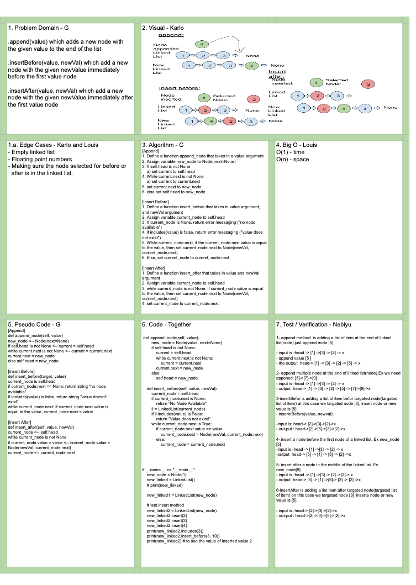

# Data Structures and Algorithms

## Language: `Python`

# Linked List Implementation
[Click to be directed to Code Challenge](https://github.com/gracerosemary/data-structures-and-algorithms/tree/master/python/code_challenges/linked_list)      

## Challenge
.append(value) which adds a new node with the given value to the end of the list
.insertBefore(value, newVal) which add a new node with the given newValue immediately before the first value node
.insertAfter(value, newVal) which add a new node with the given newValue immediately after the first value node

## Solution
   

## Approach & Efficiency
Write code based on feature tasks and implement tests based on testing prompts.  