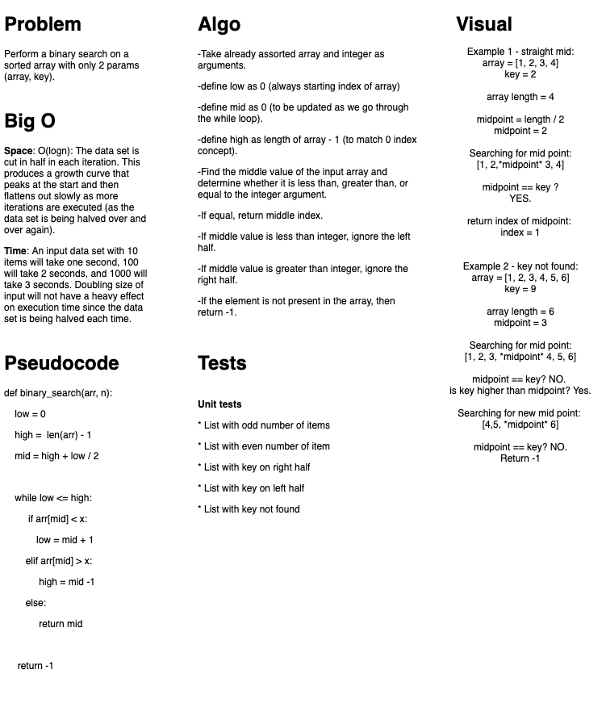

# Data Structures and Algorithms

## Language: `Python`

# Binary search in a sorted 1D array

## Challenge
Write a function called `BinarySearch` which takes in 2 parameters: a sorted array and the search key. Without utilizing any of the built-in methods available to your language, return the index of the array’s element that is equal to the search key, or -1 if the element does not exist.  

## Approach & Efficiency
For the whiteboard, we used draw.io and mapped out our layout for the problem domain, visual, algorithm, Big O, Pseudocode, Code, and Test. Then we wrote out our tests and implemented our code.  

## Solution
    

## Partner
Logan Jones