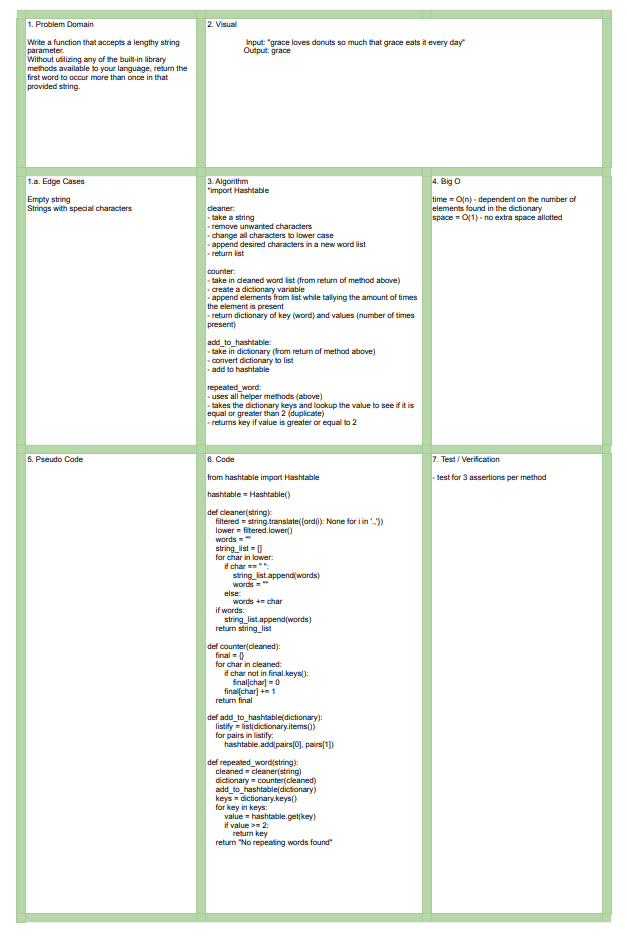

# Data Structures and Algorithms

## Language: `Python`

# Repeated Words
[Click to be directed to Code Challenge](https://github.com/gracerosemary/data-structures-and-algorithms/tree/master/python/challenges/repeated_word)       

## Challenge
Write a function that accepts a length string parameter. Without utilizing any built-in methods, return the first words to occur more than once in the provided string. 

## Tests
Write at least 3 test assertions for each method defined. 

## Approach & Efficiency
time = O(n) - dependent on the number of elements found in the dictionary
space = O(1) - no extra space allotted

## Solution
   