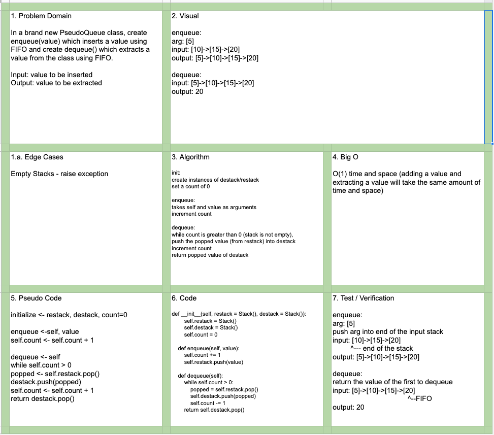

# Data Structures and Algorithms

## Language: `Python`

# PseudoQueue
[Click to be directed to Code Challenge](https://github.com/gracerosemary/data-structures-and-algorithms/tree/master/python/code_challenges/queue_with_stacks)      

## Challenge
Create a brand new PseudoQueue class that utilizes 2 Stack objects. 

## Approach & Efficiency
`enqueue(value)` which inserts value into the PseudoQueue, using a first-in, first-out approach.
`dequeue()` which extracts a value from the PseudoQueue, using a first-in, first-out approach.

## Solution
  