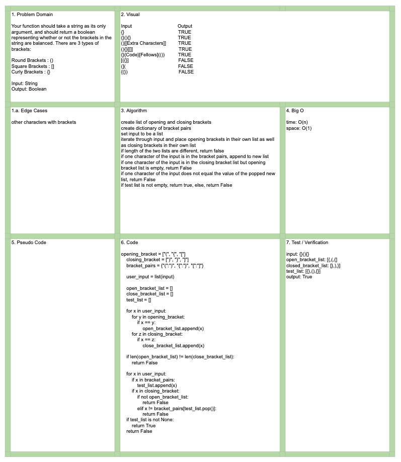

# Data Structures and Algorithms

## Language: `Python`

# Multi-Bracket Validation
[Click to be directed to Code Challenge](https://github.com/gracerosemary/data-structures-and-algorithms/tree/master/python/challenges/multi_bracket_validation)      

## Challenge
Create a function called `multi_bracket_validation(input)` that takes a string as its only argument. Should return a boolean representing whether or not the brackets in the string are balanced. 

Brackets:
Round: ()  
Square: []  
Curly: {}  

## Approach & Efficiency
Check bracket type and quantity of each bracket. Match up pairs of each bracket used. If bracket pair match is found, return True, else return False. 

Input: `{}{Code}[Fellows](())`	  
Ouput: TRUE

Input: `[({}]`  
Output: FALSE

## Solution
  